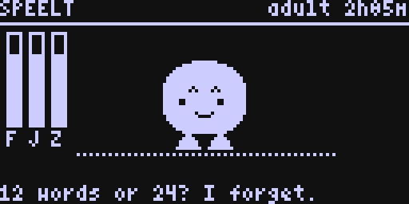
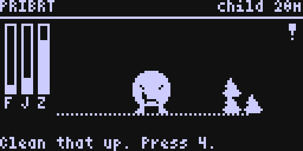
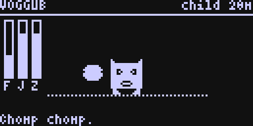
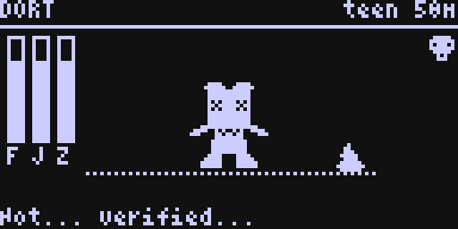
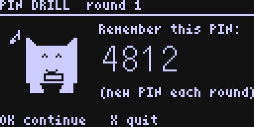
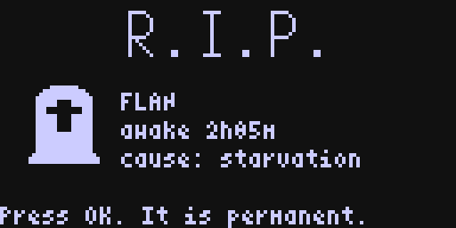

# COLDCARD Tamagotchi

> **This is an unofficial fork. It is not made, endorsed, or supported by Coinkite.**
> It is firmware for a COLDCARD Mk4 that you have *retired from Bitcoin forever*.
> It is signed with the public developer key, which every COLDCARD bootloader
> treats as "somebody random built this" and warns you about at every boot.
> **Do not put a seed on a device running this. Do not sign anything with it.**
> See [NOTICE](NOTICE). Coinkite's original README is [README-coldcard.md](README-coldcard.md).

A $200 steel-clad, dual-secure-element, air-gapped, paranoid Bitcoin signing device
whose remaining purpose is keeping a small creature alive.

| | |
|---|---|
|  |  |
|  |  |
|  |  |

*(Screens rendered by the firmware's own `display.py`, fonts and sprite code through
`pet/tools/render.py`; the OLED shows the same pixels.)*

## What it does

- **Time only passes while the device is powered.** There is no battery-backed clock
  in a COLDCARD, so the pet does not experience time while unplugged. Unplugging it
  is putting it to bed; it wakes up rested, having dreamed something.
- **It can only die on your watch.** It ages only while the pet screen is up. Neglect
  has to be witnessed. Death is permanent: a tombstone is written to the card *before*
  the save files are deleted, and there is no undo, resurrect, or reset.
- **The microSD card *is* the pet.** Saves live on the card, atomically (two alternating
  slots, counter + CRC32). Pull the card and you've taken the creature. Insert it into
  another COLDCARD running this firmware and it wakes up there. No card: it tells you
  loudly that nothing is being saved and lets you play in RAM anyway.
- **Genetics from the real hardware TRNG.** Each egg's genome is 32 bytes straight off
  the STM32 true-random generator (`ckcc.rng_bytes`), the path Coinkite fixed after the
  [2021–2026 entropy bug](README-coldcard.md#security-advisory). Appetite, temperament
  (sunny / grumpy / anxious / feral), stubbornness, immune system, lifespan, body shape,
  eye style and name all come from it. Two pets do not feel the same.
- **Sneakernet breeding.** Two living adults on one card can be bred into an egg whose
  genome is a per-byte mix of both parents plus fresh TRNG mutations. Generation and
  parentage go in the save. Pets travel between devices by handing someone a card.
- **NFC, via a phone.** Mk4's NFC is a passive tag, so two COLDCARDs can't tap each
  other. A phone can read the pet off one device (*NFC: Beam Pet*) and write it into
  another (*NFC: Receive Pet*). SD stays the real transport.
- **Graveyard.** Every death leaves a tombstone: name, lifetime stats, genome, cause,
  and a generated epitaph. *Pet menu → Graveyard* reads them back.
- **It has opinions.** The status line is the creature talking. Grumpy ones say things
  like "Your PIN was better." Anxious ones keep asking whether the card is still in.

## Controls

The pet screen maps actions straight onto the keypad. Key **8** shows this on-device.

```
 1  Feed (meal)      2  Snack           3  Play (minigames)
 4  Clean poop       5  Medicine        6  Scold
 7  Status/stats     8  Help            9  Pet menu
 0  Make it talk    OK  Pat it          X  Leave the pet screen
```

- **Egg:** any key warms it. It hatches after ~90 seconds of attention.
- **Minigames** (key 3): *PIN Drill* — it shows you a PIN, you type it back, rounds get
  longer; *Which Way?* — guess which way it looks with 4/6. Winning raises happiness
  and burns weight.
- **Pet menu** (key 9): Back To Pet, New Egg, Switch Pet, Breed, Graveyard, Rename,
  NFC Beam/Receive, Help.
- After login, if a live pet is on the card it wakes up on screen automatically.
  `Virtual Pet` is also the first item of every top-level menu.

## Caring for it

Three gauges on the left: **F**ood, **J**oy, **Z**zz (energy). Poop appears on the floor
some minutes after meals; leave it and the pet gets sick (skull icon). Sick pets need
medicine (5), sometimes twice. A `!` means it wants something; ignore a real call for
five minutes and that's a *care mistake*, which shortens its life. Stubborn, undisciplined
pets throw fake tantrums and refuse food — scold them (6) when they do, and only then.
Snacks are fun and fattening. Energy only comes back from sleep, and sleep only comes
from unplugging it.

It dies of: starvation, untreated sickness, a broken heart, too many snacks, or old age.

All decay rates, thresholds, stage timings and lifespan are in **one labelled block** at
the top of [`shared/pet_model.py`](shared/pet_model.py) (`TUNING KNOBS`).

## Building

The `.dfu` is built by GitHub Actions on every push
([`.github/workflows/pet-firmware.yml`](.github/workflows/pet-firmware.yml)) inside
Coinkite's own build container, and attached as a workflow artifact
(`tamagotchi-mk4-dfu`). Tags named `pet-v*` also publish a GitHub Release with the file.

Locally (Linux/macOS/WSL with Docker):

```bash
git clone --branch tamagotchi https://github.com/Ak1ra00/CC.git && cd CC
git submodule update --init external/micropython external/libngu external/mpy-qr external/ckcc-protocol
git -C external/micropython submodule update --init lib/stm32lib
git -C external/libngu/libs submodule update --init bech32 cifra secp256k1
sed 's/musl-dev make/musl-dev gcc make/' stm32/dockerfile.build | docker build -t coldcard-build -
docker run --rm -v "$PWD:/work/src" -w /work/src -e HOME=/tmp -u "$(id -u):$(id -g)" coldcard-build sh stm32/pet-build.sh
ls stm32/*.dfu
```

Version string is `5.6.2p` (upstream 5.6.2 + pet). Never sign with `signit --high_water`.

### Tests (no toolchain needed)

```bash
pip install pytest pillow
cd pet && python -m pytest
python pet/tools/render.py          # re-render the screenshots
```

`pet/tests/` runs the pet model against a fake clock (one tick = one awake-second), the
card store against a temp directory, and the whole UX loop — ticker, autosave, death,
menus, minigames, breeding, card yank — under CPython asyncio with a scripted keypad.

### Desktop simulator

Coinkite's simulator (`unix/`) needs Linux/macOS (WSL on Windows): follow
[unix/README.md](unix/README.md) for `make setup && make`, then

```bash
cd unix && ./simulator.py --pet            # boots straight into the pet
./simulator.py --pet --eject               # no card: RAM mode
```

The simulated card is `unix/work/MicroSD/`; the pet's files appear under `pets/` there.
`^Z` snapshots the screen, `^S`/`^E` records a GIF.

## Flashing

Prerequisites: a Mk4 (or Mk5) with a **main PIN set** — the firmware upgrade path is
only available after login. Nothing here touches the bootloader; it cannot be replaced
and always runs first.

1. Download `*-mk-tamagotchi.dfu` from the Actions artifact or a Release. Check its
   SHA-256 against `built-sha256.txt` from the same build.
2. Copy it to a microSD card. On the device: **Advanced/Tools → Upgrade Firmware →
   From MicroSD**, pick the file, confirm. (Or over USB: `pip install ckcc-protocol` then
   `ckcc upgrade file.dfu`.)
3. On reboot the bootloader shows a large warning that the firmware is signed with a
   dev key, plus a forced delay. **This is expected and normal**, every single boot.
4. Log in with your PIN. A `Virtual Pet` item is at the top of the menu. Put a card in.

The Mk4 has one microSD slot; the pet and any firmware `.dfu` can share the card.

## Back to official firmware

The path back is the same path in: download the official `.dfu` from
[coldcard.com/downloads](https://coldcard.com/downloads), verify it against Coinkite's
signed `signatures.txt`, put it on a card, **Advanced/Tools → Upgrade Firmware → From
MicroSD** (or `ckcc upgrade`). The bootloader verifies Coinkite's signature and the
warning goes away.

Two things could break that path, and this fork guards against both:

- The bootloader has one-way *downgrade protection*: an OTP "high-water" timestamp
  that, once raised, refuses any firmware with an older build date. It is raised **only**
  by *Danger Zone → Set High-Water* (which this fork disables) or by a firmware header
  flag (`signit --high_water`, which the build never sets). Installing this fork does
  not raise it. **Never** re-enable or use either on a build newer than the official
  release you want to return to.
- Nothing in *Brick Me*, trick PINs, PIN/secure-element handling, or the bootloader is
  modified by this fork. `git diff upstream/master..tamagotchi -- shared/` shows exactly
  what changed: five new `pet_*.py` modules, their entries in `manifest.py`, menu
  wiring in `flow.py`, one hook in `main.py`, the splash text, and the disabled
  Set High-Water item.

If your COLDCARD ever refuses an official image as a "downgrade", pick a newer official
release than this build's timestamp; that will always be accepted.

## Layout

```
shared/pet_model.py    the creature: stats, stages, genome, breeding, death, words  (pure Python)
shared/pet_sprites.py  ASCII-art bodies, eyes, mouths, props -> Display.icon() tuples
shared/pet_draw.py     every screen as a plain function of (display, pet, frame)
shared/pet_store.py    atomic two-slot saves, tombstones, active pointer, card adapter
shared/pet_ux.py       async UX: PetScreen, ticker, menus, minigames, NFC relay
pet/tests/             pytest: model, store, UX under a fake clock
pet/tools/             fakehw.py (pure-Python framebuf + real display.py), fakeux.py, render.py
stm32/pet-build.sh     container build + key-zero signing
```

## Licence

Coinkite's firmware is MIT + Commons Clause ([COPYING-CC](COPYING-CC), via `LICENSE`)
and that continues to cover this fork as a whole. The new pet files are additionally
offered under plain MIT ([LICENSE-PET](LICENSE-PET)). See [NOTICE](NOTICE).
